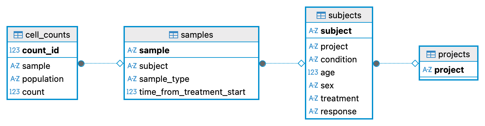
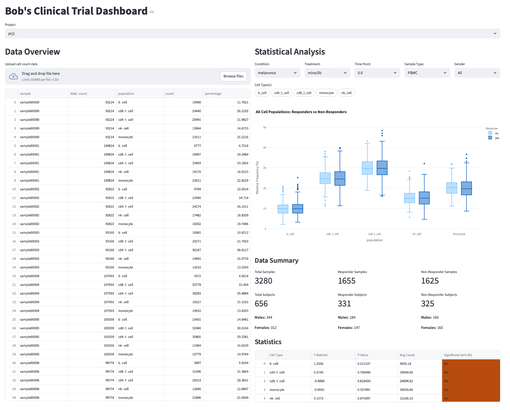

# Bob's Clinical Trial Dashboard

A Streamlit-based interactive dashboard for analyzing flow cytometry data from clinical trials. This application helps researchers identify immune cell population patterns that predict treatment response.

**Live Dashboard**: [https://clinicalcytometrydashboard-9af8az47b63qzsiramcyd7.streamlit.app](https://clinicalcytometrydashboard-9af8az47b63qzsiramcyd7.streamlit.app)

---

# Setup Instructions

>[!NOTE]: For this project I used a conda environment. You can setup the conda environment with the environment.yaml file or a virtual environment with the requirements.txt file using pip.

## Running Locally:
1. **Setup Conda Environment** 
```sh
conda env create -f environment.yaml
conda activate clinical_cytometry_dashboard_env
```

2. **Run the Streamlit web app** from the repo home directory:
```sh
streamlit run app/dashboard.py
```

3. **Upload Data**: Upload the `.csv` file from the `/data` directory and clear the `success` message to reload the page

## Running in GitHub Codespaces:
1. Open this repository in Codespaces
2. Install dependencies:
```sh
pip install -r requirements.txt
```
3. Run the dashboard:
```sh
streamlit run app/dashboard.py
```

---

# Technical Design
## Database Design
### Tables:
#### 1. Projects Table
**Purpose**: To store separate projects so the user can switch between projects  
**Table Layout**  
| Column | Type | Description |
|--------|------|-------------|
| project | String Primary Key | Unique project ID |

#### 2. Subjects Table
**Purpose**: To store metadata on the research subject  
**Table Layout**:
| Column | Type | Description |
|------------|----------------------|----------------------------------------------|
| subject | TEXT PRIMARY KEY | Unique ID |
| project | TEXT FOREIGN KEY | Acts as a link from sample to project |
| condition | TEXT | condition of the subject |
| age | INTEGER | Age at start of collection |
| sex | CHAR | Gender either M or F |
| treatment | TEXT | treatment used on subject |
| response | TEXT | Yes or No |

#### 3. Samples Table
**Purpose**: This table is to hold each collection item. That way, if there is more collections, we just have to add another entry here.  
**Table Layout**:

| Column | Type | Description |
|------------|-------------|------------------------------------------|
| sample | TEXT PRIMARY KEY | Unique ID |
| subject | TEXT FOREIGN KEY | Link to Subjects |
| sample_type | TEXT | Records the type of sample |
| time_from_treatment_start | REAL | Decimal Value Represented in hours |

#### 4. Cell_Counts Table
**Purpose**: A table to hold flow cytometry results. If new cell types are added to the table then its just another entry.  
**Table Layout**:

| Column | Type | Description |
|------------|---------|-----------------------------------|
| count_id | INTEGER PRIMARY KEY | Auto-incrementing ID |
| sample | TEXT FOREIGN KEY | Link to Samples |
| population | TEXT | b_cell, cd8_t_cell, etc. |
| count | INTEGER | The numerical result |

#### Database Design Rationale:
I designed the database to accommodate potential data growth. New cell types might be analyzed, additional time points might be collected, and multiple projects 
might need to be analyzed from the same organization. This design allows flexibility in expanding the studies while preventing redundancy in standardized
patient metadata, which remains constant throughout the trial duration.

The normalized schema is designed to scale efficiently:

1. **No Data Redundancy**: Subject metadata (age, sex, condition) is stored once per subject, not repeated for every sample
2. **Flexible Cell Types**: New cell populations can be added without schema changes—simply insert new rows in `cell_counts`
3. **Efficient Filtering**: Current queries use WHERE clauses on indexed foreign keys (project, condition, treatment) to filter at the database level




---

## Project Structure and Code Architecture

### Directory Layout:
```
Clinical_Cytometry_Dashboard/
├── app/
│   ├── dashboard.py          # Streamlit UI and visualization layer
│   ├── database.py           # Database operations and data access layer
│   └── __pycache__/          # Python bytecode cache
├── data/
│   └── cell-count.csv        # Sample flow cytometry data
├── design_docs/
│   ├── database_flow_diagram.png
│   └── clinical_dashboard.png
├── environment.yaml          # Conda environment configuration
├── requirements.txt          # Pip dependencies for streamlit at runtime
├── README.md                 # Project documentation
└── bobs_flow_project.db      # SQLite database (generated at runtime)
```

### Code Architecture:

#### **`database.py` - Data Access Layer**
This module encapsulates all database operations and SQL queries:
- **`Project_Database` class**: Main interface for all database operations
- **Data initialization**: `_create_tables()`, `load_csv_data()`
- **Query methods**: `get_projects()`, `get_conditions()`, `get_sample_types()`, `get_statistical_subset()`, etc.
- **Error handling**: `@log_db_errors` decorator catches exceptions, logs them, and returns user-friendly `DataAccessError`
- **Separation of concerns**: Zero UI dependencies—completely reusable and testable

#### **`dashboard.py` - Presentation Layer**
This module handles all user interaction and visualization:
- **Cached wrapper functions**: Streamlit-wrapped database calls with `@st.cache_data` for performance
- **`render_data_overview()`**: Displays relative frequency table for uploaded data
- **`render_statistical_analysis()`**: Manages filter dropdowns, generates box plots, and displays statistics
- **UI logic**: Calls database methods and transforms results for visualization
- **No SQL**: All database queries go through abstracted database methods

### Design Rationale:

#### **Why Separate Database and Dashboard Layers?**
1. **Maintainability**: Changes to database logic don't affect UI code
2. **Testability**: Database methods can be tested independently without Streamlit
3. **Reusability**: The database layer could serve a CLI, API, or different UI framework
4. **Error Isolation**: Database errors are caught and transformed before reaching users
5. **Scalability**: Easy to migrate from SQLite to PostgreSQL without changing dashboard code

#### **Why This Specific Architecture?**
- **Normalized database schema**: Eliminates data redundancy, supports growth to hundreds of projects and thousands of samples
- **Decorator-based error handling**: `@log_db_errors` provides consistent error management across all database methods without code duplication
- **Streamlit caching**: 
  - `@st.cache_resource` for database connection (persistent across reruns)
  - `@st.cache_data` for query results (invalidated on new data uploads)
  - prevents multiple queries to the database when the dashboard refreshes, and allows a refresh when new data loaded.
- **Multi-select filtering**: Allows users to analyze multiple cell populations simultaneously without recompiling plots
- **Responsive UI**: Dropdowns dynamically populate based on selected project, ensuring users only see relevant filters

### Flow of information:

**Separation in Practice:**
```
Dashboard: User selects to show box plots for all populations based on filters
  ↓
Database: Fetches responders vs non-responders data for provided filters
  ↓
Database: Executes SQL, returns DataFrame to dashboard
  ↓
Dashboard: Transforms data (adds gender info, calculates stats), renders charts to user
```

**Error Flow:**
```
Database: SQLite Error occurs → @log_db_errors catches it
  ↓
Logs full stack trace to app.log
  ↓
Raises DataAccessError with user-friendly message
  ↓
Dashboard: Displays message in UI without showing error trace
```

This architecture allows Bob and other clinical researchers to focus on their analysis while developers can confidently maintain and extend the system to meet their needs.

---

## User Interface Features



### Technology Choice:
For this project, I built the user dashboard using `Streamlit`. I chose this framework because it is easy to use and includes many features that would have taken significantly longer to implement from scratch. It also allows free deployment of web applications without requiring an AWS server. Although I could have used AWS, I wanted to select the option that minimized development time while providing good flexibility in dashboard design.

### Data Upload:
I added functionality for users to upload `.csv` files directly in the dashboard. If the data already exists in the database, an error is thrown, logged, and a message is displayed to inform the user. If the data is new, it is added to the database, and the user can clear the file upload for the page to refresh and display the new data.

### Dashboard Layout:
I designed the dashboard to display data organized by projects. Users select which project samples they want to view before the dashboard displays any statistics or information.

When the user uploads data and there is data to analyze, the dashboard presents a summary in a scrollable table in the left column showing the percentage of each cell population in each sample, filtered by the selected project. On the right, users can select different conditions, sample types, time points, treatments, gender (optional), and cell types to analyze via box plots. If data is unavailable, no chart or statistics will be shown, and a message will inform the user. I used Plotly to display plots because it offers similar functionality to ggplot with interactive features. Users can interact with plots and visualize individual conditions and statistics by hovering over data points.

Below the box plot are summary statistics comparing responders vs. non-responders, allowing users to assess under which conditions the responses were statistically significant. This section utilizes Welch's t-test to account for possible unequal variance between populations, and displays the average cell count for each population under the selected filters.

To visualize initial conditions, users simply select their project, then choose the conditions, sample type, time point, and treatment. The statistics automatically update to reflect the p-values for each cell type under the selected conditions. If a statistic is considered significant (p-value < 0.05), it is visually flagged for the user.

All tables and figures in this dashboard are interactive and downloadable.

### Interactive Visualizations:
For the plot, I utilized Plotly's box plot, which allows for more interactivity and customization than matplotlib. I added options for users to select which cell populations they want to view using a multi-select pill interface. Users can select specific cell populations or view all populations simultaneously. The box plot displays responders vs. non-responders for each selected cell population, with all data points visible alongside the box and whisker plots for complete data transparency.

### Error Handling:
Error handling is implemented with two distinct components: user-facing errors and logged errors. For every exception that occurs, a user-facing error message displays in the interface without showing the error trace. When an error occurs, the user is notified, and the full error trace along with a summary message is written to an error log accessible to developers.

I created a custom `DataAccessError` class to provide better control over error handling and to separate what is displayed to users versus what is logged. The class has a default message but allows for custom messages when methods don't use the custom decorator.

### Performance Optimization:
To reduce overhead from repeatedly fetching unique keys in the database based on data filters, I implemented caching for these values so they can be reloaded without requerying the database every time the page loads. The initial query requires some load time, but subsequent interactions are quick and don't require the data to be fetched again.

---

## Future Architectural Improvements
Given more time to implement this project, I would refactor the code to separate the statistical analysis and plotting logic into dedicated modules. I would also write unit tests for methods in the statistical analysis module (if separated), database.py, and dashboard.py.

This separation would make the features more testable. Currently, statistical methods and plotting logic are embedded within other methods in both database.py (relative frequency calculations) and dashboard.py (plot generation and summary statistics). Although the program functions well and delivers a good user experience, it would become significantly more maintainable with this separation of concerns, especially if users request additional statistical analyses or visualization features.

---

>[!NOTE]: AI was used to tidy up documentation flow and to correct grammatical mistakes. However, all ideas in this document and the program implementation came from me. 